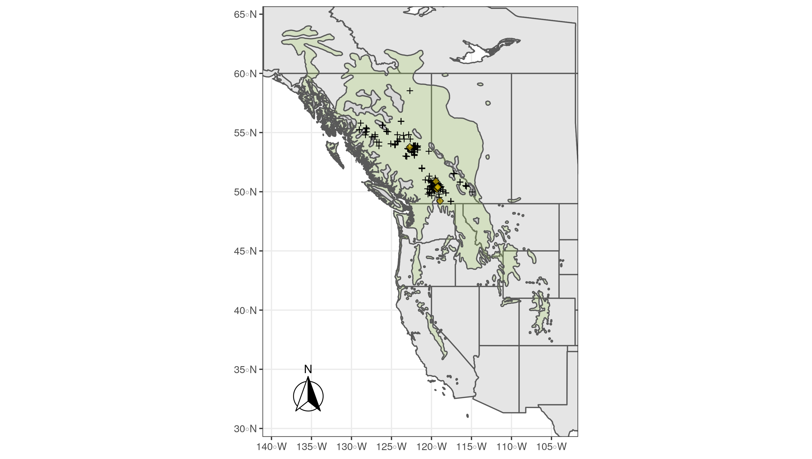

<!-- Flowering phenology in lodgepole pine -->
<!-- I haven't presented in a long time and my graphs aren't polished, so it might take a bit of work to follow. 
Please interrupt if things really aren't making sense.
Looking for a lot of kinds of feedback today. Working on writing this up.
Glaring issues with analysis?
How to frame as a paper, what to emphasize.
Literature, recent lab work, context. -->
```{r setup, include=FALSE}
knitr::opts_chunk$set(echo = FALSE, warning = FALSE)

def.chunk.hook  <- knitr::knit_hooks$get("chunk")
knitr::knit_hooks$set(chunk = function(x, options) {
  x <- def.chunk.hook(x, options)
  ifelse(options$size != "normalsize", paste0("\n \\", options$size,"\n\n", x, "\n\n \\normalsize"), x)
})

library(dplyr)
library(ggplot2)
library(forcats)
library(tidybayes)
library(ggbeeswarm)
library(ggalt)
library(viridis)

factororder <- readRDS("objects/factororder.rds")
```
## Lodgepole pine flowering biology

In spring

- Male strobili shed pollen
- Female strobili capture pollen

Wind pollinated

## Phenology matters

- Gene flow
  - assortative mating
  - (local) adaptation
  - clinal variation
- Seed orchard management
- Tree breeding
- Assisted migration

<!-- Talk about jean paul's work on how there can be clinal variation just from phenology - fucking up your local adapation estimates -->

## What controls the timing of flowering phenology in lodgepole pine?

::::::::::::: {.columns}
::: {.column}
<!-- We can't see most development phases and have to infer from events. Review Rob Guy. -->
- Chilling accumulation
- Forcing accumulation
- Genetics

::: 
::: {.column}
- Assume met 
<!-- Safe with interior, not coastal -->
- assume > 5 $^\circ$C
<!-- Standard, and experimental work in both gymnosperms and angiosperms in Finland suggests a decent approximation -->
- Is there clinal variation?
:::
:::::::::::::::


## Data
- 748 clones of 259 genotypes
- grown in 7 seed orchards across BC
- flowering state recorded every few days over a one day to several week period
- 15 total years of data collection

Provenance

- seeds and scions from 143 natural stands
- grafted onto rootstock to create a clone bank
- clone bank scions selected based on superior growth, form

## Map




## Data
```{r data}
phenf <- readRDS("objects/phenf.rds")
ggplot(phenf, aes(x = sum_forcing, color = Event_Label, linetype = Sex)) +
  stat_ecdf() +
  labs(title = "Cumulative distribution of accumulated forcing at observation", caption = "raw data") +
  scale_colour_viridis_d() +
  theme_dark(base_size = 18) +
  ylab("") +
  xlab("GDD")
```

## How much forcing?

- 4 models
  - Begin (male) pollen shed
  - End (male) pollen shed
  - Begin (female) receptivity
  - End (female) receptivity
- Thermal time - transferable
- Test for provenance climate effect - MAT
- Account for variance due to site, year, genotype, and clone
- Account for unbalanced and censored data

## Likelihood model

Likelihood of forcing observations would have a normal distribution

$$
f_i \sim \mathrm{Normal}(\phi_i, \sigma)
$$
But all of my data is censored.

```{r censoring}
censdf <- readRDS("objects/censdf.rds") %>%
  rename(Event = Event_Label) 
censdf$Event <- c("begin", "begin", 'end', 'end')
knitr::kable(censdf)
```

## Likelihood model - for censored data

So we assume an underlying normal distribution that we're observing badly.

- Left censored start data (hazard function) 
<!-- more likely to observe flowering after flowering has started -->
$$
\mathrm{Pr}[f_i < U] = \int_\infty^U \mathrm{Normal}(y \mid \phi_i, \sigma) dy
$$
- Right censored end data (survival function)
<!-- more likely to observe pollen shed is finished after it has finished -->
$$
\mathrm{Pr}[f_i > L] = \int_L^\infty \mathrm{Normal}(y \mid \phi_i, \sigma) dy
$$
- Interval censored data
$$
\mathrm{Pr}[L > f_i > U] = \int_L^U \mathrm{Normal}(y | \phi_i, \sigma) dy
$$

## Modeling the mean

$$
\phi_i = \alpha + \beta MAT + \delta_{Site, i} + \delta_{Year, i} + \delta_{Clone, i} + \delta_{Ramet, i}
$$

- $\alpha$: Overall mean forcing requirement
- $\beta$: Provenance climate effect using MAT as covariate
- $\delta$: Offsets from the overall mean based on site, year, clone, and ramet

## Priors

<!-- Limit parameter estimates to forcing accumulations possible at our sites during late spring, when lodgepole pine are known to flower in British Columbia and approximately known length of the flowering period from prior work -->
::::::::::::: {.columns}
::: {.column width="45%"}
- limits based on possible forcing accumulation
- gamma distribution for intercept
- half normal for offset parameter standard deviations

<!-- Forcing accumulation is always positive and the overall distribution across reasonable ranges is strongly right skewed, so we used a gamma distribution with shape ($\alpha$) and rate ($\beta$) parameters derived from the mean and standard deviation of the May-June historical forcing accumulation. -->

<!-- site and year have relatively few levels with which to estimate $\sigma_{factor}$, half normal priors with their relatively thin tails were used to help constrain offset parameter standard deviations -->
:::
::: {.column width="65%"}
```{r typicalclimate}
typical_year_forc <- read.csv("data/typical_year_forc.csv") %>% # from temp mean at each site across 1945-2012
  mutate(Date = as.Date(Date_scale)) %>% select(-Date_scale) %>%
  filter(Site %in% c('Kalamalka', 'KettleRiver', 'PGTIS', 'PRT', 'Sorrento', 'Tolko', 'Vernon')) %>%
  filter(DoY < 180) %>%
  mutate(level = forcats::fct_relevel(Site, factororder$site))

ggplot(typical_year_forc, aes(x = Date, y = sum_forcing, color = Site)) +
  geom_line() +
  scale_x_date(date_breaks = "1 month", date_labels =  "%b") +
  ggtitle("Forcing accumulation in a typical year") +
  theme_classic(base_size = 18) 
  
```

:::
:::::::::::::

## Fit in Stan via `brms` package
```{r, echo = TRUE, eval=FALSE, size = "footnotesize"}
# model formula
bform <- brmsformula(sum_forcing | cens(censored, upper) ~ 
                       MAT + (1|Site) + (1|Clone) + (1|Year) + (1|Tree))

# model prior
bprior <- c(prior("gamma(3.65, 0.01)", class = "Intercept"),
            prior("normal(0,15)", class = "sigma"),
            prior("normal(0,9)", class = "sd"),
            prior("normal(0,5)", class = "b"))

# female/receptivity begin
fbfit <- brm(bform, data = fbdat,
             prior = bprior,
             init = initpars,
             iter = 4000,
             cores = 6,
             chains = 6)
```

## Fit

Modelling events I didn't observe - so how can I check how my model is doing?


<!-- Are the mean begin, end, and length retrodictions within the expected ranges? The exact flowering period is never observed because of censoring. -->
<!-- # Using the first and last observed flowering forcing/doy we construct the max begin and minimum end forcing/doy and minimum flowering period length in forcing and days for the data. -->
<!-- # Using the last observed before flowering forcing/doy and the first observed after flowering forcing/doy, we construct a minimum begin day, maximum end day, and maximum flowering period length for the data. We expect model estimates to be between the min and max ranges for the observations. -->

```{r fit}
fretrocomp <- readRDS("objects/fretrocomp.rds") %>%
  select(-contains("Length"))
knitr::kable(fretrocomp, format = "simple", digits = 2)
```

## Results - Provenance effect similar for end and begin
<!-- - Male > female -->
<!-- - End = begin -->
<!-- - All very similar -->

```{r}
slopes <- readRDS(file = "objects/slopes.rds")
ggplot(slopes, aes(x = .value, y = event, fill = Sex)) +
  stat_slabinterval(alpha = 0.5) +
  scale_fill_viridis_d(option = "B") +
  xlab("GDD per MAT") +
  ylab("") +
  labs(title = 'MAT effect', caption = '2000 draws from the posterior')
```

## Results - Mean and variation

::::::::::::: {.columns}
::: {.column}
```{r}
intercepts <- readRDS("objects/intercepts.rds")
ggplot(intercepts, aes(y = fct_rev(event), x = .value, colour = Sex)) +
  stat_gradientinterval(position = "dodge") +
  scale_colour_viridis_d() +
  labs(title = "Intercepts", caption = "2000 draws from the posterior") +
  ylab("") +
  xlab("GDD") +
  theme_classic(base_size = 18) +
  theme(legend.position = "top") +
  scale_x_continuous(breaks = scales::pretty_breaks(n=10))
```
:::
::: {.column}
```{r}
# variation <- readRDS("objects/variation.rds")
# ggplot(variation, aes(y = fct_rev(.variable), x = .value, colour = .variable, linetype = Sex)) +
#   stat_pointinterval(position = "dodge") +
#   scale_colour_viridis_d(option = "B") +
#   labs(title = "Standard deviation of pop mean & offsets", caption = "2000 draws from the posterior") +
#   ylab("") +
#   xlab("GDD") +
#   facet_grid(event ~ .) +
#   guides(color = "none", size = "none") +
#   theme_dark(base_size = 18) +
#   theme(legend.position = "top")
offsets_summary <- readRDS("objects/offsets_summary.rds")
offsets_summary %>%
  select(model, Sex, event, factor, level, .value, .point) %>% distinct() %>%
  ggplot(aes(y=.value, x = model, colour = Sex, shape = event)) +
  geom_quasirandom(alpha = 0.5) +
  facet_wrap("factor") +
  labs(title = "Offset medians", caption = "2000 draws from posterior") +
  geom_hline(yintercept = 0, linetype =3, colour = "darkgray") +
  theme_dark(base_size = 18) +
  ylab("GDD") +
  scale_colour_viridis_d() +
  theme(legend.position = "top") +
  geom_hline(yintercept = 0, linetype = 3) +
  coord_flip()
```
:::
:::::::::::::

## Results - Forcing predictions expectation

<!-- average predicted outcome ignoring group specific deviations  -->
```{r}
fepred_allsites <- readRDS('objects/fepred_allsites.rds')
ggplot(fepred_allsites, aes(x = MAT, y = .epred)) +
  stat_lineribbon(aes(y = .epred), .width = c(.99, .95, .8, .5)) +
  #stat_slabinterval(data = intercepts, aes(x=8, y = .value, color = "intercept"), orientation = "vertical") +
  #geom_lineribbon(data = intercepts_summary, aes(x = MAT, y = .value, ymin = .lower, ymax =.upper, fill = "no MAT"), alpha = 0.5) +
  scale_fill_brewer() +
  theme_classic() +
  facet_grid(Sex ~ event) +
  ggtitle("Forcing requirements for trees sourced from focal sites", subtitle = "expectation (mean) predictions") +
  ylab("Forcing (Growing Degree Days)")
```

## Day of year predictions intro

Temperature timeseries -> forcing accumulation timeseries

Then match to forcing predictions

Focus on 5 sites (as provenances as sites)

```{r}
sitedat <- read.csv("../lodgepole_climate/data/climateBC/climatebc_locs_Normal_1961_1990Y.csv") 

siteMAT <- sitedat %>%
  filter(id == "site", Site %in% c("Kalamalka", "KettleRiver", "PGTIS", "Trench", "Border")) %>%
  select(Site, MAT, Elevation) %>%
  mutate(MAT = round(MAT, 1)) %>%
  arrange(MAT)

knitr::kable(siteMAT)
```


## Results - MAT Day of Year
<!-- Want to show you year to year variation because I'm about to focus on means -->
```{r}
doy_annual_plotting <- readRDS('objects/doy_annual_plotting.rds')
dplot2 <- readRDS("objects/dplot2.rds")

ggplot(dplot2, aes(x = Year, ymin = .lower_begin, ymax = .upper_begin, fill = Sex)) +
  geom_ribbon(alpha = 0.5) +
  geom_ribbon(aes(x = Year, ymin = .lower_end, ymax = .upper_end, fill = Sex), alpha = 0.5) +
  geom_line(data=doy_annual_plotting, aes(x = Year, y = DoY, color = Sex, linetype = event), inherit.aes = FALSE) +
  facet_grid(Sex ~ Site) +
  labs(title = "Predicted flowering periods", subtitle = "posterior expectation, ribbons = uncertainty, lines = medians") +
  ylab("Day of Year") +
  scale_color_viridis_d(option = "B") +
  scale_fill_viridis_d(option = "B") +
  theme_dark(base_size = 18) +
  theme(legend.position = "bottom")
```

## Results - DoY expectations in common garden

```{r awayone}
doy_typical_all_at_PGTIS <- readRDS("objects/doy_typical_all_at_PGTIS.rds") %>%
  filter(Site %in% c("Kalamalka", "KettleRiver", "PGTIS", "Trench", "Border"), MAT %in% siteMAT$MAT) 

ggplot(doy_typical_all_at_PGTIS, aes(x = intercept, xend = DoY, y=MAT, shape = Sex)) +
  geom_dumbbell(
    colour = "#a3c4dc",
    colour_xend = "#0e668b",
    size = 4
  ) +
  facet_grid(Sex ~ event) +
  xlab("Day of Year") +
  ylab("Provenance MAT") +
  ggtitle("Change in flowering day of year expectation with MAT effect", subtitle = "typical year, trees grown at PGTIS") +
  geom_vline(data = doy_typical_all_at_PGTIS, aes(xintercept = intercept)) +
  theme(legend.position = "top")
```

## Results - DoY expecations on the landscape

```{r home1, echo = FALSE}
doy_typical_home <- readRDS("objects/doy_typical_home.rds") 

ggplot(doy_typical_home, aes(x = intercept, xend = wMAT, y=MAT, shape = Sex)) +
  geom_dumbbell(
    colour = "#a3c4dc",
    colour_xend = "#0e668b",
    size = 4
  ) +
  facet_grid(Sex ~ event) +
  xlab("Day of Year") +
  ylab("Provenance MAT") +
  ggtitle("Change in flowering day of year expectation with MAT effect", subtitle = "typical year, trees grown at home") +
  theme(legend.position = "top")
```

## Results - MAT Day of Year

::::::::::::: {.columns}
::: {.column}
### Common garden

<!-- - typical year -->
<!-- - dropping uncertainty -->
```{r away}
doy_typical_all_at_PGTIS <- readRDS("objects/doy_typical_all_at_PGTIS.rds") %>%
  filter(Site %in% c("Kalamalka", "KettleRiver", "PGTIS", "Trench", "Border"))

ggplot(doy_typical_all_at_PGTIS, aes(x = intercept, xend = DoY, y=MAT, shape = Sex)) +
  geom_dumbbell(
    colour = "#a3c4dc",
    colour_xend = "#0e668b",
    size = 4
  ) +
  facet_grid(Sex ~ event) +
  xlab("Day of Year") +
  ylab("Provenance MAT") +
  ggtitle("Change in flowering day of year expectation with MAT effect", subtitle = "typical year, trees grown at PGTIS") +
  geom_vline(data = doy_typical_all_at_PGTIS, aes(xintercept = intercept)) +
  theme(legend.position = "top")
```
:::
::: {.column}

### Home

```{r home, echo = FALSE}

ggplot(doy_typical_home, aes(x = intercept, xend = wMAT, y=MAT, shape = Sex)) +
  geom_dumbbell(
    colour = "#a3c4dc",
    colour_xend = "#0e668b",
    size = 4
  ) +
  facet_grid(Sex ~ event) +
  xlab("Day of Year") +
  ylab("Provenance MAT") +
  ggtitle("Change in flowering day of year expectation with MAT effect", subtitle = "typical year, trees grown at home") +
  theme(legend.position = "top")
```
:::
:::::::::::::

## Overlap

```{r overlap, echo=FALSE}
typical_overlap <- readRDS("objects/typical_overlap.rds")
#matlabels <- filter(typical_overlap, SiteM == SiteF)

ggplot(typical_overlap, aes(x = SiteM, y=SiteF, fill = overlap)) +
  geom_tile() +
  scale_fill_viridis() +
  #annotate("text", x = matlabels$SiteM, y = matlabels$SiteF, label = matlabels$MATF)
  ggtitle("Days of overlap in a typical year", subtitle = "provenance MAT label on diagonal") +
  xlab("Male flowering") +
  ylab("Female flowering") 

```

## Summary
- Males have longer period and start slightly before, end after females
- ~5 more GDD per 1 degree MAT required for flowering
- Countergradient variation should increase flowering period overlap
- Overlap depends on geographic location and provenance climate
- Anybody can predict flowering time in lodgepole with just daily temperature data and MAT - with no modelling required.

### Questions
- But why is there countergradient variation?

### More
- Climate change (1 month shift, no big overlap changes)
- Does it all wash away in the light of individual variation?

## Extra

```{r forcingMAT}
fpred <- readRDS('objects/fpred.rds')
ggplot(fpred, aes(x = MAT, y = sum_forcing)) +
  stat_lineribbon(aes(y = .prediction), .width = c(.99, .5)) +
  scale_fill_brewer() +
  facet_grid(Sex ~ event) 
```


